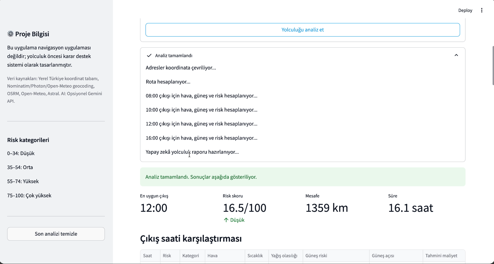
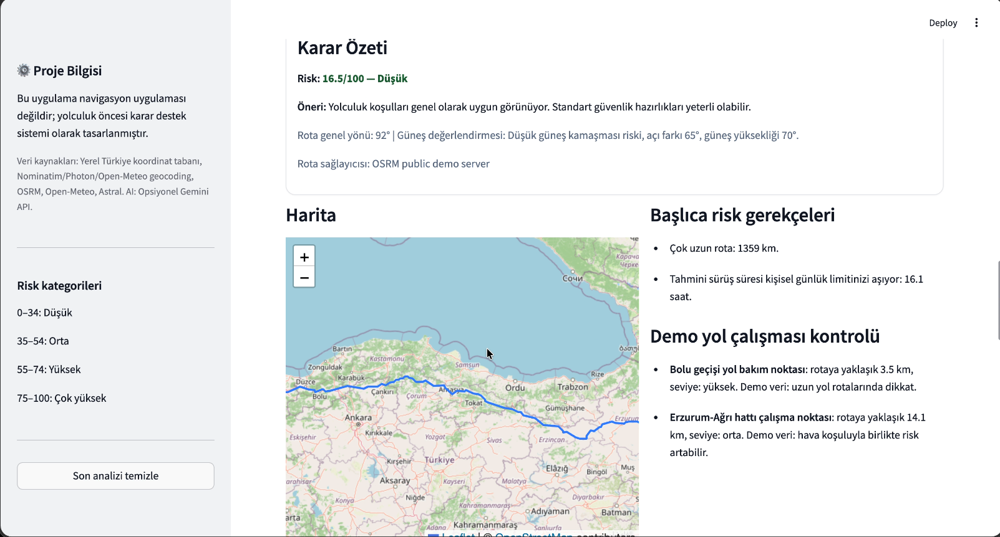
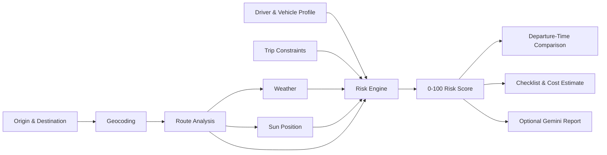

# YolGuard AI

**AI-assisted pre-trip risk assessment and decision-support system built with Python and Streamlit.**

YolGuard AI is a web-based prototype designed to support **pre-trip decision making** rather than turn-by-turn navigation. It combines route characteristics, weather conditions, sun-glare exposure, vehicle type, driver experience, passenger profile, trip duration and other constraints to compare departure alternatives and generate a **0–100 travel risk score**.

The core score is produced by a transparent rule-based risk engine. **Google Gemini is optional** and is used only to turn the calculated results into a more readable, personalized travel report; the application still works without an API key.

> **Note:** YolGuard AI is a decision-support prototype. It does not provide a safety guarantee and should not replace official traffic, weather, navigation or emergency information.

## Application Preview



*Departure-time comparison showing the recommended departure, calculated risk score, route distance and estimated travel duration.*



*Route visualization with the decision summary, major risk factors and demo roadwork checks.*

---

## Key Features

- Compares multiple departure times for the same journey
- Calculates route distance and estimated driving time
- Uses hourly weather forecasts near the route midpoint
- Evaluates sun-glare risk from route direction and solar position
- Incorporates vehicle type and driver experience into the risk model
- Considers passenger count, baby/child/pet travel constraints
- Includes electric-vehicle range considerations
- Estimates fuel/energy, food and accommodation costs
- Displays the route on an interactive map
- Explains major risk drivers and generates a preparation checklist
- Produces an optional Gemini-assisted travel report
- Falls back to a local template report when Gemini is unavailable
- Logs analysis results locally to CSV
- Supports optional Google Sheets logging
- Uses fallback geocoding/routing behavior to improve demo resilience

---

## How It Works



For each selected departure time, YolGuard AI evaluates the trip independently. The alternative with the lowest calculated risk is presented as the preferred departure option together with the underlying risk components and recommendations.

---

## Risk Assessment Model

The risk engine is intentionally separate from the generative-AI layer. This makes the main decision logic inspectable and allows the application to operate even when no AI API is configured.

### Base weighted components

| Component | Weight |
|---|---:|
| Weather conditions | 25% |
| Route length / duration | 25% |
| Driver / vehicle profile | 35% |
| Sun glare | 10% |
| EV / additional factor | 5% |

The model also applies **hard safety floors** to combinations where a simple weighted average would understate risk, such as vehicle-capacity violations or selected high-risk motorcycle scenarios.

### Risk categories

| Score | Category |
|---:|---|
| 0–34 | Low |
| 35–54 | Moderate |
| 55–74 | High |
| 75–100 | Very High |

The application also returns the major reasons contributing to the score so the result is not presented as a black box.

---

## Data Sources and Integrations

| Service / Library | Purpose |
|---|---|
| OpenStreetMap / Nominatim | Address geocoding |
| Open-Meteo Geocoding | Fallback place geocoding |
| Komoot Photon | Additional geocoding fallback |
| OSRM public server | Driving route, distance and duration |
| Open-Meteo | Hourly weather forecast |
| Astral | Solar azimuth and elevation |
| Folium / streamlit-folium | Interactive route map |
| Google Gemini | Optional natural-language travel report |
| Google Sheets | Optional analysis logging |

A small local Türkiye coordinate database and direct latitude/longitude input are also supported for more resilient demonstrations.

---

## Technology Stack

- **Python**
- **Streamlit**
- **Pandas**
- **Requests**
- **Folium**
- **Astral**
- **Google Gen AI SDK**
- **gspread / Google Auth**
- **pytest**

---

## Project Structure

```text
YolGuardAI/
├── app.py
├── requirements.txt
├── README.md
├── .env.example
├── .streamlit/
│   └── config.toml
├── data/
│   └── demo_roadworks.csv
├── modules/
│   ├── ai_advisor.py
│   ├── checklist.py
│   ├── config.py
│   ├── expenses.py
│   ├── geocoding.py
│   ├── risk_model.py
│   ├── roadworks.py
│   ├── routing.py
│   ├── sheets_logger.py
│   ├── sun.py
│   ├── utils.py
│   └── weather.py
├── tests/
│   └── test_risk_model.py
├── run_mac_linux.sh
└── run_windows.ps1
```

---

## Installation

### 1. Clone the repository

```bash
git clone <repository-url>
cd YolGuard-AI
```

Alternatively, download the repository as a ZIP file and extract it.

### 2. Create a virtual environment

**Windows PowerShell**

```powershell
python -m venv .venv
.\.venv\Scripts\Activate.ps1
```

**macOS / Linux**

```bash
python3 -m venv .venv
source .venv/bin/activate
```

### 3. Install dependencies

```bash
python -m pip install --upgrade pip
pip install -r requirements.txt
```

### 4. Configure environment variables

Copy `.env.example` as `.env`.

**Windows PowerShell**

```powershell
Copy-Item .env.example .env
```

**macOS / Linux**

```bash
cp .env.example .env
```

The application can run without Gemini or Google Sheets credentials.

---

## Optional Configuration

### Gemini

Add a Google AI Studio API key to `.env`:

```env
GEMINI_API_KEY=your_api_key
GEMINI_MODEL=gemini-2.5-flash
```

If no Gemini key is provided, YolGuard AI automatically generates a local template-based report instead.

### Google Sheets

To enable optional Google Sheets logging:

```env
GOOGLE_SERVICE_ACCOUNT_FILE=service_account.json
GOOGLE_SHEET_NAME=YolGuardAI_Logs
```

Do **not** commit service-account credentials or real API keys to the repository.

### Nominatim User-Agent

For public Nominatim requests, configure an identifying user agent:

```env
NOMINATIM_USER_AGENT=YolGuardAI/1.0 (your-email@example.com)
```

---

## Running the Application

```bash
streamlit run app.py
```

Streamlit will normally open the application at:

```text
http://localhost:8501
```

The repository also includes helper scripts for Windows and macOS/Linux.

---

## Example Workflow

1. Enter an origin and destination.
2. Select a travel date and several candidate departure times.
3. Choose the vehicle type and driver-experience level.
4. Enter passenger and trip constraints.
5. Run the analysis.
6. Compare departure alternatives by risk score.
7. Review:
   - route distance and duration,
   - weather conditions,
   - sun-glare exposure,
   - risk components and reasons,
   - estimated trip cost,
   - preparation checklist,
   - optional AI-generated report.

---

## Testing

Run the automated tests with:

```bash
pytest
```

For a basic syntax check:

```bash
python -m py_compile app.py modules/*.py
```

The included tests cover representative low/high-risk comparisons, EV-range behavior, vehicle-capacity rules and long-distance rookie-motorcycle scenarios.

---

## Design Decisions

### Transparent scoring before generative AI

The risk score is calculated by deterministic application logic rather than by a language model. Gemini receives the already-computed trip context and is used only as an optional explanation layer.

### Graceful fallbacks

The project includes fallbacks for several external dependencies:

- alternate geocoding providers,
- local coordinates for selected Türkiye locations,
- coordinate input,
- approximate route estimation if OSRM is unavailable,
- conservative default weather data if weather retrieval fails,
- local report generation if Gemini is not configured or fails.

These choices allow the application to remain usable even when a public demo service is temporarily unavailable.

---

## Current Limitations

- The OSRM public server does not provide real-time traffic conditions.
- Roadwork information is currently based on a small demo CSV dataset rather than a live official feed.
- Weather forecasts are estimates and can change.
- Route weather is represented using a selected point near the route rather than a full route-wide meteorological model.
- The risk weights and safety rules are prototype decision-support heuristics; they are not a validated road-safety model.
- Public geocoding/routing services may impose usage limits or availability restrictions.
- The current user interface and generated report are primarily in Turkish.

For production use, the project would require validated safety methodology, official/real-time road and traffic data, production-grade routing infrastructure, stronger input validation, monitoring and broader automated test coverage.

---

## Future Improvements

- Live traffic and official roadwork-data integration
- Route-segment weather analysis instead of a single representative point
- Persistent user profiles and saved trips
- Expanded automated test suite
- Multilingual user interface
- Production deployment with managed secrets
- Data-driven calibration of risk weights using historical travel/safety data

---

## Author

**Ekin Gökalp**

YolGuard AI was developed as a Python/Streamlit decision-support software project combining API integration, rule-based risk modelling, data processing, visualization and optional generative AI.
